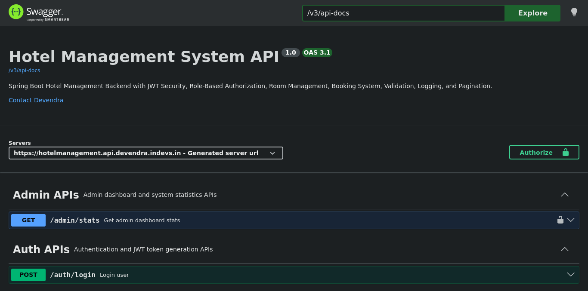
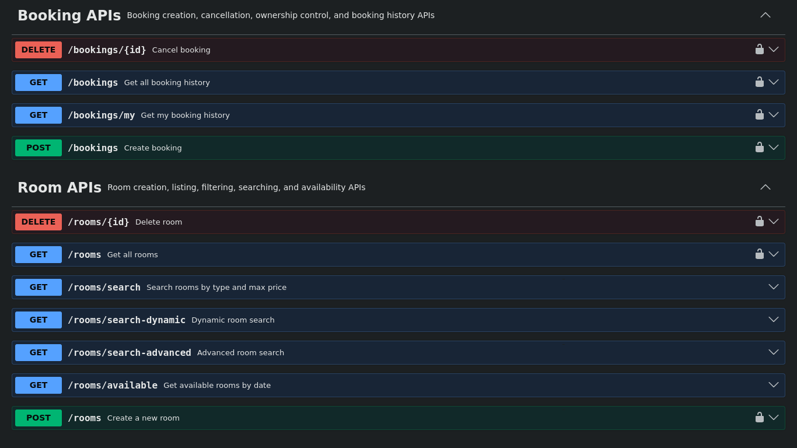
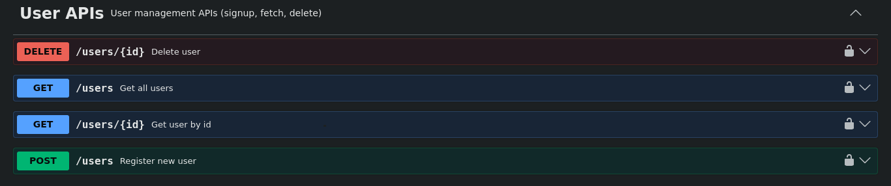

# Hotel Management System Backend

A production-oriented Hotel Management REST API built using Spring Boot and PostgreSQL, featuring JWT authentication, role-based authorization, room booking management, date-overlap validation, email notifications, and admin analytics.

Designed to demonstrate real-world backend engineering practices including layered architecture, DTO-based APIs, centralized exception handling, validation, logging, testing, and secure authentication.
> Backend system for:
> - User authentication & JWT security
> - Role-based access control (USER / ADMIN)
> - Room booking with ownership validation
> - Date-based room availability (overlap logic)
> - Admin dashboard statistics

---

## Live Demo

API Base URL:
https://hotelmanagement.api.devendra.indevs.in/

Swagger UI:
https://hotelmanagement.api.devendra.indevs.in/swagger-ui/index.html

---

## Project Overview

The Hotel Management System is a backend REST API where:

* Administrators can create user accounts and users can log in using their assigned credentials.
* Passwords are securely stored using BCrypt.
* JWT tokens are generated after successful login.
* APIs are protected using role-based authorization.
* Admin users can manage rooms and view system statistics.
* Registered users can book rooms and manage their own bookings.
* Room availability is handled using date-overlap logic instead of permanently blocking a room.
* APIs return a consistent response format using a common `ApiResponse<T>` wrapper.
* Global exception handling provides clean and meaningful error messages.
* Swagger/OpenAPI documentation is available for API testing and demo.
* Unit and controller tests validate important business and security logic.

---

## Highlights

- Secure JWT-based authentication and authorization
- Role-based access control (USER / ADMIN)
- Booking ownership validation (user can only cancel own booking)
- Date-overlap booking logic (real hotel system behavior)
- Advanced room search with filters and pagination
- Clean global exception handling with proper HTTP status codes
- Production-style logging
- Unit and controller testing using JUnit and Mockito
- Automated booking confirmation and cancellation emails
- Admin dashboard statistics API

---

## Design Principles

- Stateless JWT Authentication
- Role-Based Access Control
- DTO-Based API Design
- Layered Architecture
- Global Exception Handling
- Date Overlap Booking Validation
- Booking Ownership Control
- Email Notification System
- Pagination & Dynamic Filtering
- Admin Analytics Dashboard

---

## Tech Stack

| Layer         | Technology                   |
|---------------|------------------------------|
| Language      | Java                         |
| Framework     | Spring Boot                  |
| Security      | Spring Security, JWT, BCrypt |
| Database      | PostgreSQL                   |
| ORM           | Spring Data JPA, Hibernate   |
| API Style     | REST API                     |
| Documentation | Swagger / OpenAPI            |
| Build Tool    | Maven                        |
| Logging       | SLF4J                        |
| Testing       | JUnit 5, Mockito, MockMvc    |
| Email Service | Spring Mail                  |

---

## API Documentation





---

## Core Features

### Authentication and Authorization

* User login with email and password.
* JWT token generation after successful authentication.
* JWT contains user email and role.
* Role-based access control using Spring Security.
* Method-level authorization using `@PreAuthorize`.
* Protected admin APIs using `ADMIN` role.
* Booking APIs protected for authenticated users.
* Clean handling of `401 Unauthorized` and `403 Forbidden` responses.

### Email Notifications

* Booking confirmation email sent automatically after successful booking.
* Booking cancellation email sent automatically after cancellation.
* Email delivery handled using Spring Mail.

### User Management

* ADMIN-controlled user creation.
* BCrypt password hashing.
* Newly created users are assigned the USER role by default.
* Public users cannot create accounts directly.
* ADMIN users manage user onboarding.
* User listing and user lookup support.

### Room Management

* Admin can create hotel rooms.
* Admin can delete rooms.
* Room number duplication is prevented.
* Room type validation is handled using enum-based logic.
* Rooms can be fetched with pagination and sorting.
* Rooms can be searched dynamically using optional filters.

* Supported Room Types:
  - STANDARD
  - DELUXE
  - SUITE

### Booking Management

* Authenticated users can book rooms.
* User identity is taken from JWT instead of request body.
* Users cannot create bookings on behalf of another user.
* Users can view their own booking history.
* Admin can view all booking history.
* Booking history supports pagination and sorting.
* Users can cancel only their own bookings.
* Admin can cancel any booking.

### Date-Based Room Availability

The project uses date-overlap logic to determine room availability.

A room is considered unavailable for a requested date range if an existing booking overlaps with the requested range.

Overlap condition:

```text
newCheckIn < existingCheckOut
AND
newCheckOut > existingCheckIn
```

This allows the same room to be booked for different non-overlapping dates.

Example:

| Existing Booking | New Booking     | Result   |
|------------------|-----------------|----------|
| Apr 25 - Apr 27  | Apr 28 - Apr 30 | Allowed  |
| Apr 25 - Apr 27  | Apr 26 - Apr 29 | Rejected |
| Apr 25 - Apr 27  | Apr 24 - Apr 26 | Rejected |

### Advanced Room Search

Users can search available rooms using:

* Check-in date
* Check-out date
* Room type
* Maximum price
* Pagination
* Sorting

### Admin Dashboard

Admin can access dashboard statistics such as:

* Total users
* Total rooms
* Total bookings
* Available rooms

---

## Project Architecture

```text
com.project.hotel

├── config          # Security and application configuration
├── controller      # REST controllers
├── dto             # Request and response DTOs
├── entity          # JPA entities
├── exception       # Custom exceptions and global exception handling
├── repository      # Spring Data JPA repositories
├── security        # JWT utility, JWT filter, user details service
└── service         # Business logic layer
```

---

## Layered Flow

```text
Client Request
↓
Security Filter Chain
↓
JWT Validation
↓
Controller
↓
Service Layer
↓
Repository
↓
PostgreSQL Database
↓
Response DTO
↓
ApiResponse<T>
```

---

## Security Flow

```text
POST /auth/login
↓
AuthenticationManager validates credentials
↓
User loaded from database
↓
Password verified using BCrypt
↓
JWT generated with email and role
↓
Client sends token in Authorization header
↓
JWT filter validates token
↓
SecurityContext is populated
↓
@PreAuthorize checks role
↓
API access allowed or denied
```

Authorization header format:

```http
Authorization: Bearer <JWT_TOKEN>
```

---

## API Response Format

All APIs follow a standard response structure:

```json
{
  "status": 200,
  "message": "Success message",
  "data": {}
}
```

Example success response:

```json
{
  "status": 200,
  "message": "Rooms fetched successfully",
  "data": {
    "content": []
  }
}
```

Example error response:

```json
{
  "status": 403,
  "message": "Access denied. You do not have permission to use this API",
  "data": null
}
```

---

## Important API Endpoints

### Auth APIs

| Method | Endpoint      | Access | Description                 |
|--------|---------------|--------|-----------------------------|
| POST   | `/auth/login` | Public | Login and receive JWT token |

### User APIs

> User accounts are created and managed by administrators. Self-registration is not supported in this system.

| Method | Endpoint      | Access | Description         |
|--------|---------------|--------|---------------------|
| POST   | `/users`      | Admin  | Create user account |
| GET    | `/users`      | Admin  | Get paginated users |
| GET    | `/users/{id}` | Admin  | Get user by ID      |
| DELETE | `/users/{id}` | Admin  | Delete user         |

### Room APIs

| Method | Endpoint                 | Access      | Description                                   |
|--------|--------------------------|-------------|-----------------------------------------------|
| POST   | `/rooms`                 | Admin       | Create room                                   |
| GET    | `/rooms`                 | User/Admin  | Get paginated rooms                           |
| DELETE | `/rooms/{id}`            | Admin       | Delete room                                   |
| GET    | `/rooms/search`          | Public/User | Search rooms by type and price                |
| GET    | `/rooms/search-dynamic`  | Public/User | Dynamic room filtering                        |
| GET    | `/rooms/available`       | Public/User | Get rooms available for date range            |
| GET    | `/rooms/search-advanced` | Public/User | Advanced date, type, price, pagination search |

### Booking APIs

| Method | Endpoint         | Access      | Description                          |
|--------|------------------|-------------|--------------------------------------|
| POST   | `/bookings`      | User/Admin  | Create booking                       |
| DELETE | `/bookings/{id}` | Owner/Admin | Cancel booking                       |
| GET    | `/bookings/my`   | User/Admin  | Get logged-in user's booking history |
| GET    | `/bookings`      | Admin       | Get all booking history              |

### Admin APIs

| Method | Endpoint       | Access | Description              |
|--------|----------------|--------|--------------------------|
| GET    | `/admin/stats` | Admin  | Get dashboard statistics |

---

## Sample Requests

### Login

```http
POST /auth/login
Content-Type: application/json
```

```json
{
  "email": "admin@gmail.com",
  "password": "admin123"
}
```

### Create Room

```http
POST /rooms
Authorization: Bearer <ADMIN_TOKEN>
Content-Type: application/json
```

```json
{
  "roomNumber": "101",
  "type": "DELUXE",
  "price": 2500
}
```

### Create Booking

```http
POST /bookings
Authorization: Bearer <USER_TOKEN>
Content-Type: application/json
```

```json
{
  "roomId": 1,
  "checkIn": "2026-05-10",
  "checkOut": "2026-05-12"
}
```

### Search Available Rooms

```http
GET /rooms/available?checkIn=2026-05-10&checkOut=2026-05-12&page=0&size=5&sortBy=price
```

### Advanced Room Search

```http
GET /rooms/search-advanced?checkIn=2026-05-10&checkOut=2026-05-12&type=DELUXE&maxPrice=3000&page=0&size=5&sortBy=price
```

---

## Exception Handling

The project uses a centralized `GlobalExceptionHandler` to return clean and consistent error responses.

Handled cases include:

* User not found
* Room not found
* Booking not found
* Duplicate room number
* Room already booked
* Invalid room type
* Invalid date range
* Invalid JSON or date format
* Validation errors
* Unauthorized booking access
* Access denied
* Bad login credentials
* Missing request parameters
* Invalid parameter types
* Unexpected server errors

---

## Logging

The project uses SLF4J logging for important application events.

Logging strategy:

| Level | Usage                                                 |
|-------|-------------------------------------------------------|
| INFO  | Successful business operations                        |
| WARN  | Invalid input, unauthorized access, failed operations |
| DEBUG | JWT/security internals                                |
| ERROR | Unexpected system errors                              |

Sensitive data such as passwords and JWT tokens are not logged.

---

## Testing

The project includes service-layer and controller/security testing using JUnit 5, Mockito, and MockMvc.

Tested areas include:

* Booking creation success case
* Booking rejection when dates overlap
* Booking rejection for invalid date range
* Booking cancellation by owner
* Booking cancellation rejection for non-owner
* Booking cancellation allowed for admin
* Room creation validation
* Duplicate room prevention
* User service behavior
* Custom user details loading
* Controller/security behavior

Testing approach:

```text
Arrange → Act → Assert
```

---

## Database Design

Main entities:

```text
User
├── id
├── name
├── email
├── password
└── role

Room
├── id
├── roomNumber
├── type
├── price
└── available

Booking
├── id
├── checkIn
├── checkOut
├── user
└── room
```

Relationships:

```text
User 1 ---- Many Booking
Room 1 ---- Many Booking
Booking Many ---- 1 User
Booking Many ---- 1 Room
```

---

## How to Run Locally

### 1. Clone Repository

```bash
git clone <your-repository-url>
cd <project-folder>
```

### 2. Create PostgreSQL Database

```sql
CREATE DATABASE hotel_db;
```

### 3. Configure Application Properties

Use environment variables or local configuration.

Example local configuration:

```properties
spring.datasource.url=jdbc:postgresql://localhost:5432/hotel_db
spring.datasource.username=postgres
spring.datasource.password=your_password

spring.jpa.hibernate.ddl-auto=update
spring.jpa.show-sql=true
spring.jpa.properties.hibernate.format_sql=true

jwt.secret=your_secure_jwt_secret_key
server.port=9090
```

### 4. Run Application

```bash
mvn spring-boot:run
```

### 5. Open Swagger UI

```text
http://localhost:9090/swagger-ui/index.html
```
---

## Future Improvements

Planned improvements:

* Refresh token support
* Payment module
* Review and rating module
* Docker support
* CI/CD pipeline
* Role management dashboard
* More integration tests
* Frontend integration

---

## Key Backend Concepts Demonstrated

This project demonstrates:

* Layered architecture
* DTO-based API design
* Spring Security authentication and authorization
* JWT-based stateless security
* BCrypt password hashing
* Role-based access control
* Method-level security using `@PreAuthorize`
* JPA relationships
* Date-overlap booking logic
* Pagination and sorting
* Dynamic filtering
* Global exception handling
* Standard API response structure
* Logging best practices
* Unit and controller testing
* Swagger API documentation

---

## Project Status

```text
Core Backend Features: Completed
JWT Security: Completed
Role-Based Authorization: Completed
Booking Management: Completed
Date Overlap Validation: Completed
Email Notifications: Completed
Admin Dashboard: Completed
Swagger Documentation: Completed
Deployment: Completed
README: Completed
```

---

## Author

**Devendra**

Java Backend Developer focused on building secure, scalable, and production-oriented backend applications using Java, Spring Boot, PostgreSQL, REST APIs, and modern software engineering practices.